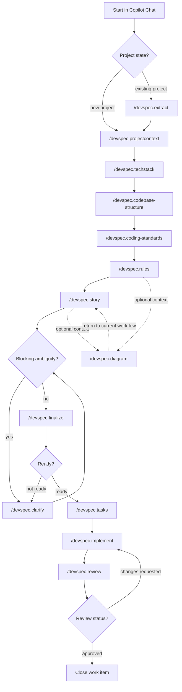

# devspec

`devspec` is a spec-driven development framework for developers using GitHub Copilot Chat.

It helps teams define the spec before coding, keep implementation aligned to that spec, and leave a reviewable paper trail in Git.

Use it when you want Copilot Chat to follow a consistent workflow for:

- project context, architecture, engineering rules, and coding standards
- feature, bug, or security work-item intake
- clarification, finalization, task planning, implementation, and review
- session recovery through Git-tracked artifacts instead of chat memory

## Quick start

`devspec` is currently installed by copying files into the target repository. There is no package-manager or CLI installer yet.

1. Open the target repository in VS Code.
2. Make sure GitHub Copilot Chat is available in that workspace.
3. Copy these folders from this repository into the target repository root:
   - `devspec/`
   - `.github/prompts/`
   - `.github/agents/`
   - `.github/skills/` when you want the bundled reusable skills
4. Commit the copied files.
5. Run the foundation commands in Copilot Chat.
6. Start the first work item with `/devspec.story`.

For a new project, start here:

```text
/devspec.projectcontext
/devspec.techstack
/devspec.codebase-structure
/devspec.coding-standards
/devspec.rules
```

For an existing project, backfill from the repository first:

```text
/devspec.extract
/devspec.projectcontext
/devspec.techstack
/devspec.codebase-structure
/devspec.coding-standards
/devspec.rules
```

When run without a source, `/devspec.extract` asks you to choose `Use current project root`, `Enter repo paths`, or `Cancel extraction`. To extract another repository or multiple repos immediately, pass explicit sources such as `D:\path\to\repo` or `UI - D:\repo-ui, API - D:\repo-api`.

After the foundation exists, use this work-item flow:

```text
/devspec.story
/devspec.finalize
/devspec.tasks
/devspec.implement
/devspec.review
```

Use `/devspec.clarify` only when story intake or finalization records a blocking question.

Use `/devspec.diagram` whenever you need an additional architecture, module, feature workflow, user journey, sequence, state, or class/domain diagram after the relevant context exists.

## What gets installed

`devspec` adds these file groups to a repository:

| Path | Purpose |
| --- | --- |
| `devspec/` | Project context, architecture, rules, templates, and work-item artifacts. |
| `.github/prompts/` | Slash-command prompts such as `/devspec.story` and `/devspec.review`. |
| `.github/agents/` | Copilot agent definitions used by the slash-command workflow. |
| `.github/skills/` | Optional reusable skills, such as exploration recovery. |

The prompt and agent folders are required. The skills folder is optional but recommended when teams want the bundled agent behaviors to travel with the repository.

Installation worked when:

- `devspec/`, `.github/prompts/`, and `.github/agents/` exist in the target repository root
- `.github/prompts/PATTERNS.md` exists
- Copilot Chat recognizes `/devspec` commands such as `/devspec.projectcontext` or `/devspec.story`
- `.github/skills/exploration-recovery/SKILL.md` exists if you copied the optional skills folder

If the commands do not appear, reopen the repository workspace in VS Code and confirm the files were copied to the target repository root rather than a nested folder.

## How devspec works

The workflow has two layers.

| Layer | Goal | Commands |
| --- | --- | --- |
| Project foundation | Define stable project context every future story should follow. | `/devspec.extract`, `/devspec.projectcontext`, `/devspec.techstack`, `/devspec.codebase-structure`, `/devspec.coding-standards`, `/devspec.rules` |
| Work-item execution | Move one feature, bug, or security issue from intake to review. | `/devspec.story`, `/devspec.finalize`, `/devspec.tasks`, `/devspec.implement`, `/devspec.review`; use `/devspec.clarify` only when blocked |

### Workflow at a glance



### Command boundaries

- Developers invoke registered `/devspec.*` slash commands from `.github/prompts/`; agent names are workflow targets and may be internal handoff details.
- `/devspec.extract` seeds foundation artifacts from existing repositories; the foundation commands refine and confirm those artifacts.
- `/devspec.coding-standards` records how code should be written; `/devspec.rules` records hard constraints, governance rules, and delivery gates.
- `/devspec.finalize` freezes the implementation-ready scope; `/devspec.tasks` turns that ready scope into ordered implementation tasks.
- `/devspec.implement` executes pending tasks; `/devspec.review` inspects the result and may send the work item back to implementation.
- Planning work maps to `/devspec.tasks`; do not use unregistered aliases such as `/devspec.plan`.

## Setup

Before setup, confirm:

- VS Code with GitHub Copilot Chat enabled
- the target repository open as the active workspace
- for multi-repo work, a VS Code multi-root workspace that includes every repository you expect agents to inspect, edit, test, or coordinate
- Git access to commit the copied framework files and later `devspec` artifacts

### Install into a target repository

1. Copy these folders into the target repository root:
   - `devspec/`
   - `.github/prompts/`
   - `.github/agents/`
   - `.github/skills/` when you want the bundled reusable skills
2. Commit the copied files.
3. Reopen the repository in VS Code if Copilot Chat does not immediately detect the new `/devspec` commands.

Choose the first foundation command based on the project:

| Project state | Start with | Why |
| --- | --- | --- |
| New project with little or no code | `/devspec.projectcontext` | There is no mature codebase to extract from yet. |
| Existing application or monorepo | `/devspec.extract` | Source code, docs, manifests, CI, and architecture clues can seed the foundation. |

On first install, live project artifacts may be created from matching `_template` files. After that, treat live files as project-owned and update them through the slash-command workflow rather than replacing them from newer templates.

For multi-repo work, keep one shared VS Code multi-root workspace open and record repo configuration in `devspec/foundation/codebase-structure.md`. That file is the source of truth for local repo paths and access requirements used by story, finalize, tasks, and implement.

### Manual upgrades

Do not directly overwrite project-owned artifacts during manual upgrades. Framework-owned files live under `.github/`, `devspec/**/_template/`, and prompt or agent support files. Live files such as `devspec/foundation/*.md`, `devspec/architecture/*.md`, `devspec/constitution.md`, and `devspec/glossary.md` are project-owned and should be migrated or merged.

| Path | Owner | Upgrade action |
| --- | --- | --- |
| `.github/skills/` | framework | Replace or diff-apply |
| `.github/agents/` | framework | Replace or diff-apply |
| `.github/prompts/` | framework | Replace or diff-apply |
| `devspec/**/_template/` | framework | Replace or diff-apply |
| `devspec/architecture/decisions/_template.md` | framework | Replace or diff-apply |
| `devspec/foundation/*.md` | project | Do not overwrite; migrate or merge |
| `devspec/architecture/*.md` | project | Do not overwrite; migrate or merge |
| `devspec/architecture/diagrams/*.md` | project | Do not overwrite; migrate or merge |
| `devspec/constitution.md` | project | Do not overwrite; confirmation required |
| `devspec/glossary.md` | project | Do not overwrite; migrate or merge |

## Important workflow rules

These are core behaviors baked into the prompts and agents:

- Foundation commands require user input or explicit confirmation when a command supports a default.
- `/devspec.story` requires user input.
- Later work-item commands accept optional additive input.
- Clarification should happen one question at a time.
- Clarification, confirmation, selection, retry, queue, and continuation questions should use explicit options plus `Custom Answer`, with exactly one recommended option and a short justification.
- Recommended next steps must be singular. Agents should not list multiple possible next prompts when one confirmation, queue item, handoff, retry, or fallback decision is pending.
- Agents must recommend only registered devspec slash commands; planning work maps to `/devspec.tasks`.
- Developers should run registered slash commands. Internal agents such as `devspec.implement-task` are handoff targets, not additional slash commands.
- New work-item folders must follow `<provider-prefix-optional>-<story-number>-<kebab-case-title>`, such as `GHUB-12345-doc-conversion` or `89564-save-user-roles`.
- `/devspec.extract` must not silently rewrite `constitution.md` principles from code inference alone.
- Repository discovery must exclude dependency, generated, cache, coverage, build-output, VCS, and tool-output paths by default; for Node.js projects, use `package.json`, lockfiles, and framework config as evidence instead of searching `node_modules/`.
- Discovery-heavy commands should check `devspec/foundation/exploration-state.md`, use known working methods first, and skip known failed searches, scripts, helper commands, provider lookups, or validation probes unless retry conditions are met.
- Work-item commands should recover from Git-tracked `devspec` artifacts first. Session memory and chat history are transient helpers, not the source of truth.
- Work items are the orchestration boundary. Tasks, target repos, target areas, and attempts are execution checkpoints inside the work item.
- A paused run should continue from the recorded current task or question. A stopped run should ask one structured continuation question before changing code.
- `/devspec.diagram` should generate one evidence-backed Mermaid diagram at a time. Architecture-level diagram files are the default; work-item diagrams are only for explicit or clearly temporary story-specific context.
- `/devspec.finalize` should mark a story `not ready` if blockers remain.
- `/devspec.tasks` must not expand scope.
- `/devspec.implement` should implement pending tasks sequentially, then ask one structured `Proceed`, `Skip`, or `Custom Answer` question after each task.
- `/devspec.review` should review against the finalized brief, not re-plan the story.

## Session recovery and continuation

Copilot and agent sessions can lose context. `devspec` handles that by making the repository, not the chat session, the durable source of truth.

Recommended enterprise model:

- Use the work item as the audit, scope, and orchestration boundary.
- Use tasks as repo-aware execution checkpoints inside the work item.
- Store current stage, current task, pending question, next action, and resume command in `Resume State`.
- Store implementation progress, attempts, changed files, validation, blockers, and rollback or roll-forward notes in `implement.md`.
- Store reusable discovery successes and failures in `devspec/foundation/exploration-state.md`.

This works for both monoliths and multi-repo systems. In a monolith, tasks usually share the same target repo and differ by module, layer, or validation surface. In multi-repo work, each executable task must name its target repo and required access, while the work item still owns the end-to-end business intent.

Run statuses:

| Status | Meaning | Resume behavior |
| --- | --- | --- |
| `active` | Work is in progress. | Continue from the current item. |
| `waiting-for-user` | A question or confirmation is pending. | Ask or preserve the recorded question. |
| `paused` | User intends to continue from the same point. | Resume directly when prerequisites still hold. |
| `stopped` | User intentionally ended the run. | Ask one `Continue`, `Pause`, `Skip`, or `Custom Answer` question before changing code. |
| `blocked` | Required evidence, access, or prerequisites are missing. | Continue only after the recorded blocker condition is resolved. |
| `complete` | The stage is done. | Hand off to the next registered command or agent. |

Retry handling is intentionally bounded. If an implementation or repair task exceeds three attempts, the agent records the failed method, failure reason, retry condition, and next safer method, then asks one structured continuation question instead of looping.

## Model recommendations

Agent frontmatter is the source of truth for model fallback order. At the time of writing, agents use this order: `GPT-5.4`, `GPT-5.3-Codex`, `Claude Sonnet 4.6`, then `Claude Haiku 4.5`.

Set thinking effort in the VS Code model picker. Prefer **High** for best quality. Use **Medium** when cost or latency matters. Avoid Low for devspec agents.

`/devspec.implement` delegates to the `devspec.implement-task` agent, so that agent appears in the table below.

| Agent | Recommended effort |
| --- | --- |
| `devspec.extract` | High |
| `devspec.projectcontext` | Medium |
| `devspec.techstack` | High |
| `devspec.codebase-structure` | High |
| `devspec.coding-standards` | High |
| `devspec.rules` | Medium |
| `devspec.story` | High |
| `devspec.clarify` | High |
| `devspec.finalize` | High |
| `devspec.tasks` | High |
| `devspec.implement-task` | High |
| `devspec.review` | High |
| `devspec.diagram` | High |

Use Medium for `devspec.story` or `devspec.clarify` only for simple single-repo projects with low coordination risk.

## Foundation workflow

These commands establish the project-wide spec that all stories must follow.

Foundation artifacts should be compact and useful to developers. Prefer summary or comparison tables for stack, repo boundaries, rules, readiness, tasks, and validation; use bullets for direct facts; use ordered lists only when sequence matters. Omit optional sections when they have no real project content.

### 1. `/devspec.extract`

Use this when you already have a repository and want Copilot to backfill `devspec` from source code and existing docs.

What it does:

- validates the confirmed current project root, repository URLs, local repository paths, or named multi-repo paths
- asks you to choose `Use current project root`, `Enter repo paths`, or `Cancel extraction` when no source is provided
- reads repository layout, routes, modules, workflows, states, services, integrations, manifests, CI/CD, docs, config, style guides, ADRs, contribution docs, and related evidence
- applies the default exclusions in `devspec/foundation/discovery-exclusions.md` unless the project records an explicit override
- prefers direct repository search and known working exploration methods before trying new generated scripts
- records practical foundation details with source evidence, confidence, scope, and required guidance
- avoids broad theory and omits optional sections that have no extracted, confirmed, inferred, or blocked content
- proposes updates to:
  - `devspec/constitution.md`
  - `devspec/architecture/overview.md`
  - live `devspec/foundation/*.md` artifacts, excluding `devspec/foundation/_template/`
- requires explicit confirmation before writing principle-level changes to `constitution.md`
- asks only one structured extraction confirmation at a time; constitution confirmation, artifact-queue approval, and Mermaid generation approval must not be asked together
- processes artifact-queue items one at a time in queue order, asking one structured question for the next unresolved item only
- seeds consistent diagram candidates from repository evidence with ID, scope, type, subject, target path, evidence source, confidence, status, output section, and notes
- treats extraction as queue-first diagram discovery; `/devspec.diagram` is the normal follow-up for generating one confirmed diagram
- closes with one next action or one structured question, not a list of possible next prompts

Use it for:

- extracting from the current repository open in VS Code
- existing products
- monorepos
- migrations where architecture and standards already exist but are undocumented

Example:

```text
/devspec.extract
```

Explicit local path example:

```text
/devspec.extract D:\code\payments-platform
```

Repository URL example:

```text
/devspec.extract https://github.com/acme/payments-platform
```

Named multi-repo example:

```text
/devspec.extract UI - D:\code\payments-ui, API - D:\code\payments-api, DB - D:\code\payments-db, Functions - D:\code\payments-functions
```

Named multi-repo input may also be newline-separated:

```text
/devspec.extract UI - D:\code\payments-ui
API - D:\code\payments-api
DB - D:\code\payments-db
Functions - D:\code\payments-functions
```

Expected outcome:

- `architecture/overview.md` gets a first-pass system view
- `architecture/artifact-queue.md` gets evidence-backed diagram candidates when durable diagrams would clarify the system
- `foundation/tech-stack.md` gets table-first stack evidence with versions, support status, sources, confidence, verification dates, and implementation guidance
- `foundation/codebase-structure.md` gets a selective repo-layout draft plus structured repo, boundary, ownership, integration, and placement tables where evidence exists
- repository layout should be a selective 4-5 level map that helps agents place new files and folders
- `foundation/coding-standards.md` gets an evidence-backed pattern catalog with optional short examples only when snippets clarify a rule
- `foundation/rules.md` gets actionable rule tables with scope, enforcement points, source, and confidence
- `constitution.md` gets only confirmed principle updates

### 2. `/devspec.projectcontext`

Use this to create or refine the canonical project brief.

What it writes:

- `devspec/foundation/project-context.md`

Use it for:

- defining product vision
- identifying users and stakeholders
- recording goals, non-goals, and business constraints
- capturing developer-facing implications with source and confidence

Example:

```text
/devspec.projectcontext Build a B2B invoice approval platform for finance teams. Primary users are AP clerks and finance managers. Goals are faster approval turnaround and auditability. Non-goals include payroll and tax filing. Constraints include SOC 2, role-based access control, and a six-week MVP timeline.
```

### 3. `/devspec.techstack`

Use this to define the real technical environment.

What it writes:

- `devspec/foundation/tech-stack.md`

Use it for:

- languages and runtimes
- frameworks and libraries
- services and infrastructure
- build, test, lint, CI/CD, and hosting choices
- version support, source evidence, and implementation or validation impact

Example:

```text
/devspec.techstack Frontend uses Next.js 15 with TypeScript. Backend uses Node.js 22 and PostgreSQL 16. Auth is Auth0. Hosting is Vercel plus AWS RDS. CI runs in GitHub Actions. Tests use Playwright and Vitest.
```

### 4. `/devspec.codebase-structure`

Use this to describe how the repository is organized.

What it writes:

- `devspec/foundation/codebase-structure.md`

Use it for:

- repo tree
- multi-repo repo configuration when applicable
- module boundaries
- ownership seams
- integration boundaries
- cross-cutting placement rules that tell developers where related code belongs

For multi-repo projects, use this stage to capture each repo's role, local path, whether it is already open in the current VS Code workspace, and its access requirement such as `reference-only`, `edit`, `edit-and-test`, `validation-only`, `release-coordination`, or `blocked`.

Agents must not assume `reference-only` or any other access requirement. When a repo access requirement is missing or ambiguous, the agent should ask one multiple-choice confirmation for that repo before writing or relying on the repo configuration.

Repos outside the current repo folder are valid multi-repo participants. Their location should not imply `reference-only`; record the local path, workspace availability, and user-confirmed access requirement separately.

The repository tree should go deep enough for file-placement decisions, usually 4-5 levels for important source roots, feature/module folders, tests, scripts, config, infrastructure, docs, and routing-critical files. Avoid exhaustive file listings.

Example:

```text
/devspec.codebase-structure Monorepo with apps/web for the customer UI, apps/admin for internal tools, packages/ui for shared components, packages/config for lint and tsconfig presets, and services/api for backend APIs. Payments logic must stay inside services/api/modules/payments.
```

### 5. `/devspec.coding-standards`

Use this to capture how the team expects code to be written.

What it writes:

- `devspec/foundation/coding-standards.md`

Use it for:

- language-specific or framework-specific coding standards
- naming and style rules
- database or SQL indentation patterns
- member grouping and ordering rules when the team provides, confirms, or the repository clearly evidences them
- documentation-comment expectations where supported, and developer comments for non-obvious implementation details
- testing expectations
- error handling
- logging and observability
- review expectations
- links to existing coding standards docs
- evidence-backed pattern catalogs with source paths and confidence
- short canonical examples for important style, indentation, SQL layout, member ordering, or framework patterns when available
- anti-patterns and conflicts only when they are provided, detected, or confirmed

Example:

```text
/devspec.coding-standards Prefer explicit TypeScript types at module boundaries. Require unit tests for business logic and Playwright coverage for critical user flows. Use structured logging with request ids. Avoid silent catch blocks. Require concise developer comments for non-obvious implementation details. Document any new environment variables in the repo docs.
```

Another example:

```text
/devspec.coding-standards Use the existing standards in docs/engineering/csharp.md and https://example.com/python-style-guide for C# and Python. Confirm any gaps before writing.
```

### 6. `/devspec.rules`

Use this to define non-negotiable delivery constraints.

What it writes:

- `devspec/foundation/rules.md`

Use it for:

- compliance requirements
- forbidden libraries or patterns
- approval gates
- production readiness rules
- enforcement points and blocking conditions developers must satisfy before completion

Example:

```text
/devspec.rules PII must stay encrypted at rest and in transit. No client-side secrets. No ORM-generated schema changes without review. Production releases require passing CI, security scan approval, and rollback notes for database migrations.
```

## How to start a user story

Once the project foundation exists, start work with `/devspec.story`, then move through finalize, tasks, implement, and review. Use `/devspec.clarify` only when a blocking question is recorded.

If you want `/devspec.story` to resolve GitHub, Jira, or Azure DevOps references, first confirm `devspec/foundation/provider-integrations.md` reflects your configured providers, accepted formats, access model, and manual fallback.

Use `/devspec.diagram` alongside the flow when a feature workflow, user journey, sequence, state, or class/domain diagram would clarify the work item.

### 1. `/devspec.story`

Use this to start or update a work item.

What it does:

- resolves a provider item when possible, or supports manual intake when provider lookup is unavailable
- creates the work-item folder
- writes `meta.md` and `story.md`
- initializes `decisions.md` and `notes.md` if the folder is new
- for features, records priority instead of severity
- keeps `meta.md` as the control record for the stable work-item record, triage routing, and workflow state
- keeps source/manual intake in `story.md#intake-source`, narrative and impact in `story.md#story-brief`, and criteria, dependencies, type-specific notes, risks, and blockers in `story.md#story-details`
- keeps work-item decisions in `decisions.md`
- keeps temporary scratch context in `notes.md` only until it can be promoted to a canonical artifact
- confirms multi-repo dependencies and records the yes/no flag plus repo names in `meta.md` when applicable
- requires multi-repo foundation configuration in `devspec/foundation/codebase-structure.md` before multi-repo story intake can continue
- leaves local paths and repo access requirements in the foundation artifact rather than duplicating them into story artifacts

Supported inputs:

- GitHub issue URL
- Jira issue key or URL
- Azure DevOps work item URL
- issue, task, bug, or PBI reference when the provider can be resolved clearly

Example with an external reference:

```text
/devspec.story https://github.com/acme/customer-portal/issues/1842
```

Example with manual-style input after fallback:

```text
/devspec.story INS-2041
```

If provider lookup succeeds, the command should show the resolved item summary and ask you to confirm before it writes the work item. The confirmation choices are `Confirm and continue`, `Reject and retry input`, `Switch to manual intake`, `Cancel`, and `Custom Answer`. A custom answer routes back through clarification and must not create or update the work-item folder until resolved.

### What gets created

The story stage creates a folder under `devspec/work-items/<work-item-folder>/`.

New work-item folders must use:

```text
<provider-prefix-optional>-<story-number>-<kebab-case-title>
```

Examples:

```text
devspec/work-items/GHUB-12345-doc-conversion/
devspec/work-items/ADO-789654-update-success-modal-message/
devspec/work-items/JIRA-56487-word-docs-upload/
devspec/work-items/89564-save-user-roles/
devspec/work-items/568912-new-report-for-daily-stock/
```

The optional provider prefix is 3-5 uppercase letters, such as `GHUB`, `ADO`, or `JIRA`. The story number must be numeric, and the title must be lowercase kebab-case.

During story intake, the command writes:

- `meta.md`
- `story.md`
- `decisions.md`
- `notes.md`

Later workflow stages add or update:

- `clarify.md`
- `finalize.md`
- `tasks.md`
- `implement.md`
- `review.md`
- `diagrams.md` only when `/devspec.diagram` is used for explicit or clearly temporary work-item-specific context

### 2. `/devspec.clarify`

Use this only to resolve blocking ambiguity.

What it writes:

- `devspec/work-items/<work-item-folder>/clarify.md`

Important behavior:

- asks exactly one blocking question at a time
- keeps active and resolved blockers in one `Clarifications` table
- keeps handoff and next-action state in `Resume State`
- uses explicit clickable options for confirmations, selections, and workflow decisions
- includes `Custom Answer`
- includes one recommended option with a short justification
- waits for your answer before proceeding

Example:

```text
/devspec.clarify
```

### 3. `/devspec.finalize`

Use this to freeze the implementation-ready brief.

What it writes:

- `devspec/work-items/<work-item-folder>/finalize.md`

Important behavior:

- marks the item `ready` or `not ready`
- does not invent missing requirements
- records readiness, implementation brief, and validation plan without duplicating section intent
- for multi-repo work, summarizes readiness while `devspec/foundation/codebase-structure.md` remains the source of truth for required repo configuration and user-confirmed access requirements
- should stay `not ready` if required multi-repo foundation configuration is missing or incomplete

Example:

```text
/devspec.finalize Ensure malware scanning happens synchronously before uploaded files become visible to end users.
```

### 4. `/devspec.tasks`

Use this to break a ready work item into implementation tasks.

What it writes:

- `devspec/work-items/<work-item-folder>/tasks.md`

Important behavior:

- must not change or expand the finalized scope
- should create ordered, implementation-oriented tasks
- should make each task an executable checkpoint with target area or files, dependency, validation, and done criteria
- should keep validation steps, type-specific checks, likely impacted areas, and done evidence on the task rows that use them
- for multi-repo work, should assign each task to a target repo and use `devspec/foundation/codebase-structure.md` as the source of truth for local repo paths and user-confirmed access requirements

Example:

```text
/devspec.tasks Prioritize backend scanning and storage quarantine before any admin UI changes.
```

### 5. `/devspec.implement`

Use this to implement pending tasks with confirmation after each task.

What it writes:

- `devspec/work-items/<work-item-folder>/implement.md`

Important behavior:

- requires `finalize.md` to be `ready`
- requires `tasks.md`
- implements pending tasks sequentially until the work is completed or the user chooses to stop or skip
- resumes from `implement.md` and `meta.md` when a prior session was paused, stopped, blocked, or waiting for user input
- for multi-repo work, uses the repo configuration in `devspec/foundation/codebase-structure.md` as the single source of truth for which physical repo path to change and what access is allowed
- validates required repo paths and access requirements before making code changes or running validation, and surfaces missing repo access as a blocker
- records task ledger state by target repo, target area, status, attempt count, last checkpoint, validation, and next action
- keeps `implement.md` detailed enough for recovery while omitting evidence rows with no changed files, repo-access checks, validation results, type-specific notes, risks, follow-ups, or retry escalations
- after each task, reports completed and pending counts and asks one structured question with `Proceed`, `Skip`, and `Custom Answer`
- once all tasks are implemented, records the completed task list and completion summary
- if the same task exceeds three attempts, explains the blocker before asking whether to proceed, skip, or provide custom direction
- updates the task ledger, implementation evidence, and execution log
- for bug fixes, records focused before-and-after code snippets in `implement.md` when useful for review or audit

Example:

```text
/devspec.implement Focus on the first backend task and include validation notes for quarantine behavior.
```

### 6. `/devspec.review`

Use this to review the implemented work against the finalized brief.

What it writes:

- `devspec/work-items/<work-item-folder>/review.md`

Important behavior:

- checks scope drift, bugs, regressions, security risks, missing validation, and missing tests
- keeps status and summary in `Review Outcome`, and required changes or tracked gaps in `Findings`
- returns `approved`, `approved-with-follow-ups`, or `changes-requested`

Example:

```text
/devspec.review Pay extra attention to regression risk around existing file upload flows.
```

### Optional: `/devspec.diagram`

Use this when you want one additional evidence-backed Mermaid diagram for an architecture area, module, feature workflow, user journey, sequence, state, or stable domain structure.

What it writes:

- `devspec/architecture/diagrams/<subject-slug>.md` by default for durable architecture, module, feature workflow, user journey, sequence, state, or class/domain diagrams
- `devspec/architecture/overview.md` only for high-level system diagrams or links to detailed diagram files
- `devspec/architecture/artifact-queue.md` for resumable proposed, confirmed, generated, skipped, or blocked diagram work with evidence and confidence
- `devspec/work-items/<work-item-folder>/diagrams.md` only for explicit or clearly temporary generated work-item diagram content, such as a one-off bug reproduction flow, migration path, security incident or threat flow, temporary implementation plan, or experiment

Important behavior:

- requires a diagram subject or related work item
- generates exactly one diagram per run unless you explicitly continue through the queue
- reuses matching artifact-queue metadata instead of reclassifying the same subject from scratch
- chooses Mermaid type from evidence or asks one structured question when ambiguous
- supports `flowchart`, `sequenceDiagram`, `journey`, `stateDiagram`, and `classDiagram`
- checks for an equivalent existing diagram before creating another one
- separates evidence-backed facts from assumptions
- keeps work-item `diagrams.md` focused on generated temporary diagram content; `architecture/artifact-queue.md` owns proposed, confirmed, generated, skipped, or blocked diagram status
- uses confidence values consistently: `observed`, `high-confidence`, or `low-confidence`
- keeps feature and module workflow diagrams out of `overview.md` unless they are truly high-level system views
- defaults to `devspec/architecture/diagrams/` even when the request mentions a work item, unless the diagram is explicit or clearly temporary story-specific context

Example:

```text
/devspec.diagram Create a workflow diagram for payment retry handling in the billing module.
```

## Command reference and step order

Registered devspec slash commands are limited to `/devspec.extract`, `/devspec.projectcontext`, `/devspec.techstack`, `/devspec.codebase-structure`, `/devspec.coding-standards`, `/devspec.rules`, `/devspec.story`, `/devspec.clarify`, `/devspec.finalize`, `/devspec.tasks`, `/devspec.implement`, `/devspec.review`, and `/devspec.diagram`.

Do not recommend unregistered commands such as `/devspec.plan`, `/devspec.architecture`, `/devspec.provider-integrations`, `/devspec.queue`, or `/devspec.decisions`. If no registered command fits, recommend a concrete file update, handoff, or structured question.

| Step | Command | Use when | Requires | Main output | Next step |
| --- | --- | --- | --- | --- | --- |
| 0 | `/devspec.extract` | Existing repositories need foundation backfill from code and docs. | Optional: blank for current root confirmation, one repo URL or local path, or named `Name - path` multi-repo entries. | `constitution.md`, `architecture/overview.md`, live `foundation/*.md` | Refine with `/devspec.projectcontext`. |
| 1 | `/devspec.projectcontext` | Product and business context need to be created or updated. | Product vision, users, goals, non-goals, and constraints. | `foundation/project-context.md` | `/devspec.techstack` |
| 2 | `/devspec.techstack` | Technical environment needs to be recorded. | Stack evidence, support status, hosting, tooling, and delivery constraints. | `foundation/tech-stack.md` | `/devspec.codebase-structure` |
| 3 | `/devspec.codebase-structure` | Repo layout, module boundaries, ownership seams, or multi-repo config need to be recorded. | Repository layout, integration boundaries, and multi-repo access requirements. | `foundation/codebase-structure.md` | `/devspec.coding-standards` |
| 4 | `/devspec.coding-standards` | Engineering expectations or observed code patterns need to be recorded. | Direct standards, links, repo-relative standards docs, or evidence-backed examples. | `foundation/coding-standards.md` | `/devspec.rules` |
| 5 | `/devspec.rules` | Operational hard constraints and delivery gates need to be recorded. | Compliance requirements, forbidden patterns, governance rules, and gates. | `foundation/rules.md` | `/devspec.story` |
| 6 | `/devspec.story` | A feature, bug, or security vulnerability needs intake. | Work-item reference or manual intake details. | `work-items/<work-item-folder>/meta.md`, `story.md`, `decisions.md`, `notes.md` | `/devspec.clarify` if blocked, otherwise `/devspec.finalize` |
| 7 | `/devspec.clarify` | A blocking question must be resolved. | Existing `story.md`. | `work-items/<work-item-folder>/clarify.md` | Repeat until unblocked, then `/devspec.finalize` |
| 8 | `/devspec.finalize` | The work item needs an implementation-ready brief. | Upstream work-item artifacts. | `work-items/<work-item-folder>/finalize.md` with `ready` or `not ready`. | `/devspec.tasks` when ready |
| 9 | `/devspec.tasks` | A ready brief needs ordered implementation tasks. | `finalize.md` marked `ready`. | `work-items/<work-item-folder>/tasks.md` | `/devspec.implement` |
| 10 | `/devspec.implement` | Pending tasks should be implemented. | `finalize.md` marked `ready` and `tasks.md`. | `work-items/<work-item-folder>/implement.md` and code changes when applicable. | `/devspec.review` |
| 11 | `/devspec.review` | Implemented work needs review against the finalized brief. | `finalize.md` and `implement.md`. | `work-items/<work-item-folder>/review.md` | Return to implementation for changes, or close the work item |
| Optional | `/devspec.diagram` | A requested architecture, module, feature workflow, user journey, sequence, state, or class/domain diagram is needed. | Diagram subject or related work item. | `architecture/diagrams/*.md` by default, `architecture/overview.md` for high-level system diagrams, `work-items/<work-item-folder>/diagrams.md` only for explicit or clearly temporary generated work-item diagram content, and `architecture/artifact-queue.md` as applicable. | Continue the current workflow |

## End-to-end examples

### Example: new project

```text
/devspec.projectcontext Build a lightweight internal CRM for a small sales team. Users are account executives and sales managers. Goals are contact tracking, pipeline visibility, and activity logging. Non-goals include marketing automation and billing.
```

```text
/devspec.techstack Use React with TypeScript for the frontend, Node.js with Fastify for APIs, PostgreSQL for storage, and GitHub Actions for CI.
```

```text
/devspec.codebase-structure Single repo with src/web, src/api, src/shared, tests/e2e, and scripts. Shared validation schemas should live under src/shared/schemas.
```

```text
/devspec.coding-standards Require tests for pipeline calculations, structured logs for API errors, and short ADRs for durable architecture decisions.
```

```text
/devspec.rules No direct production database edits. Secrets must come from environment-specific secret stores. Schema changes need migration scripts and rollback notes.
```

Then start the first work item:

```text
/devspec.story CRM-12
```

### Example: existing project

```text
/devspec.extract
```

```text
/devspec.projectcontext Warehouse operations suite for inventory control, receiving, putaway, and pick-pack-ship workflows. Users are warehouse associates, supervisors, and operations analysts. Goals are throughput, inventory accuracy, and operator efficiency.
```

```text
/devspec.techstack Confirm Node.js services, React frontend, PostgreSQL, Redis, Docker, GitHub Actions, and AWS deployment constraints.
```

Then start a story:

```text
/devspec.story https://github.com/acme/warehouse-suite/issues/932
```

## Repository layout

### `devspec/constitution.md`

Holds durable project principles that apply across all work items and all agents.

Examples:

- durable engineering, delivery, validation, security, and compliance principles
- amendment policy for principle-level changes

This file is intentionally harder to change. The extraction flow explicitly requires confirmation before principle-level updates are written.

### `devspec/foundation/`

Holds project-operational context and constraints.

- `_template/`
  Framework-owned section contracts for foundation artifacts. Installers and manual upgrades may update these files, but agents should write the live files below.
- `project-context.md`
  Product vision, intended users, goals, non-goals, constraints, and success metrics.
- `tech-stack.md`
  Languages, frameworks, services, tooling, hosting, current LTS or support status, verification dates, and delivery constraints.
- `codebase-structure.md`
  Repository layout, module boundaries, ownership seams, and integration boundaries.
- `coding-standards.md`
  Implementation expectations, testing rules, error handling, logging, documentation, and review norms.
- `discovery-exclusions.md`
  Default and project-specific paths agents should exclude from repository discovery, such as dependency, generated, build, cache, and coverage folders.
- `exploration-state.md`
  Known working and failed discovery methods for searches, scripts, provider lookups, validation probes, and extraction paths.
- `provider-integrations.md`
  Manually maintained provider intake policy for external systems such as GitHub, Jira, or Azure DevOps.
- `rules.md`
  Hard constraints, forbidden patterns, compliance rules, governance, and delivery gates.

### `devspec/architecture/`

Holds broader technical architecture.

- `_template/`
  Framework-owned section contracts for architecture artifacts. Use these to create or migrate live architecture files without overwriting project-specific content.
- `overview.md`
  System view, major components, integrations, data flow, and blockers.
- `decisions/`
  ADRs for long-lived architecture decisions.
- `decisions/_template.md`
  Framework-owned ADR template used when creating new architecture decision records.

### `devspec/work-items/`

Holds one folder per story, feature, bug, or security issue. Each work item carries its own staged artifacts from intake through review.

Each work-item artifact can include `Resume State`, which lets a new Copilot or agent session recover the current stage, pending question, next safe action, and resume command from Git-tracked files. Implementation also records task-level checkpoints in `implement.md` so monolith and multi-repo work can continue by target repo, target area, and task status.

Reusable feature workflows, user journeys, sequence diagrams, and state diagrams should live under `devspec/architecture/diagrams/` and be referenced from the work item. Use work-item `diagrams.md` only for explicit or clearly temporary story-specific generated diagram content, such as a bug reproduction flow, migration path, security incident or threat flow, temporary implementation plan, or experiment. Keep proposed, confirmed, generated, skipped, or blocked diagram status in `devspec/architecture/artifact-queue.md`.

## Advanced: extracting information from an existing project

Use `/devspec.extract` when source code, docs, manifests, CI, infrastructure config, ADRs, CODEOWNERS, or contribution docs can seed the foundation.

Extraction should apply `devspec/foundation/discovery-exclusions.md` to avoid dependency, generated, cache, coverage, build-output, VCS, and tool-output folders. Use manifests, lockfiles, framework config, CI config, docs, source roots, tests, and scripts as evidence instead.

Review extracted artifacts before relying on them:

| Artifact | Review focus |
| --- | --- |
| `devspec/constitution.md` | Durable principles only; principle-level changes require confirmation. |
| `devspec/architecture/overview.md` | Major components, system boundaries, integrations, high-level data flow, and links to detailed diagrams. |
| `devspec/architecture/artifact-queue.md` | Diagram candidates with scope, type, target path, evidence, confidence, status, and duplicate-check notes. |
| `devspec/foundation/project-context.md` | Product goals and user outcomes, because code rarely tells the whole story. |
| `devspec/foundation/tech-stack.md` | Languages, runtimes, frameworks, services, tooling, hosting, support status, and verification dates. |
| `devspec/foundation/codebase-structure.md` | Selective 4-5 level layout, module boundaries, multi-repo roles, local paths, workspace availability, and access requirements. |
| `devspec/foundation/discovery-exclusions.md` | Default and project-specific paths agents should skip during discovery. |
| `devspec/foundation/coding-standards.md` | Evidence-backed conventions, source paths, confidence, and compact examples for important patterns. |
| `devspec/foundation/rules.md` | Compliance, security, deployment, approval, and production-readiness constraints. |

After extraction, refine the foundation with human context:

```text
/devspec.projectcontext Customer portal for insurance members to view claims, upload documents, and track approvals. Primary users are policyholders and support agents. Goals are self-service and lower support volume. Non-goals include broker onboarding.
```

```text
/devspec.rules Protected health information must not be exposed in logs. Any document-upload change requires malware scanning and content-type validation. Releases need QA signoff for claims workflows.
```

## Advanced: setting up MCP servers or tools in VS Code

Use this setup when you want `devspec` to resolve external work items instead of falling back to manual intake.

1. Choose the provider access path you will support in VS Code.
   For most teams, this means an MCP server per provider or one internal tool that wraps multiple providers.
2. Install or connect that MCP server or integration tool in the VS Code environment your team uses for Copilot Chat.
3. Configure authentication outside the prompt artifacts.
   Prefer least-privilege, read-only access for story intake and review workflows unless write-back is explicitly required.
4. Verify the integration can validate and fetch a real work item before relying on `/devspec.story`.
   The integration should be able to return core fields such as title, description, status, type or labels, and canonical links.
5. Record the supported providers, accepted input formats, and manual fallback policy in `devspec/foundation/provider-integrations.md`.
   If the file is missing, initialize it from `devspec/foundation/_template/provider-integrations.md`.
6. Test one provider-backed intake example and one manual fallback example in the target repository.

You should treat provider-backed intake as ready only when VS Code can reach the configured tool, authentication works, and `devspec/foundation/provider-integrations.md` matches the behavior your team expects.

## Recommended adoption pattern

If you are introducing `devspec` to a team, this usually works well:

1. Install it into one target repo.
2. Run the foundation flow.
3. Start one real feature story.
4. Start one real bug story.
5. If relevant, run one security-vulnerability story.
6. Adjust the foundation docs after learning from those first runs.

## License

This repository is released under the [Apache License 2.0](LICENSE).
See [LICENSE](LICENSE) for the full license text.
