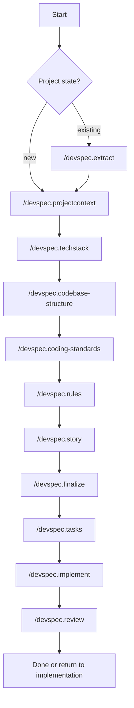

# devspec

`devspec` is a spec-driven development framework for teams using GitHub Copilot Chat and other AI coding agents.

It keeps planning, implementation, review, and recovery in Git-tracked files instead of relying on chat history.

Use it when you want agents to follow the same workflow for:

- project context, architecture, engineering rules, and coding standards
- feature, bug, and security work-item intake
- clarification, finalization, task planning, implementation, and review
- session recovery from repository artifacts

## Quick Start

Install by copying files into the target repository. There is no package manager or CLI installer yet.

1. Open the target repository in VS Code or the selected AI coding tool.
2. Copy the core framework folders into the repository root:
   - `devspec/`
   - `.github/prompts/`
   - `.github/agents/`
3. Copy optional support folders as needed:
   - `.github/skills/`
   - `AGENTS.md`
   - `GEMINI.md`
   - `.claude/`
   - `.cursor/`
   - `.gemini/`
   - `.agents/`
4. Commit the copied files.
5. Run the foundation flow.
6. Start the first work item.

For a new project:

```text
/devspec.projectcontext
/devspec.techstack
/devspec.codebase-structure
/devspec.coding-standards
/devspec.rules
```

For an existing project:

```text
/devspec.extract
/devspec.projectcontext
/devspec.techstack
/devspec.codebase-structure
/devspec.coding-standards
/devspec.rules
```

Then run the work-item flow:

```text
/devspec.story
/devspec.finalize
/devspec.tasks
/devspec.implement
/devspec.review
```

Use `/devspec.clarify` only when a work item records a blocking question. Use `/devspec.diagram` when a diagram would clarify architecture, workflow, state, sequence, or domain behavior.

## How It Works

`devspec` has two workflow layers.

| Layer | Purpose | Commands |
| --- | --- | --- |
| Foundation | Capture stable project context and rules. | `/devspec.extract`, `/devspec.projectcontext`, `/devspec.techstack`, `/devspec.codebase-structure`, `/devspec.coding-standards`, `/devspec.rules` |
| Work items | Move one feature, bug, or security issue from intake to review. | `/devspec.story`, `/devspec.clarify`, `/devspec.finalize`, `/devspec.tasks`, `/devspec.implement`, `/devspec.review` |



## Command Reference

| Command | Use when | Main output |
| --- | --- | --- |
| `/devspec.extract` | Existing code/docs should seed the foundation. | Foundation, architecture, extraction, and diagram queue artifacts. |
| `/devspec.projectcontext` | Product and business context must be recorded. | `devspec/foundation/project-context.md` |
| `/devspec.techstack` | Stack, runtime, hosting, tooling, or support status must be recorded. | `devspec/foundation/tech-stack.md` |
| `/devspec.codebase-structure` | Repository layout, boundaries, multi-repo access, or integration contracts must be recorded. | `devspec/foundation/codebase-structure.md` |
| `/devspec.coding-standards` | Engineering standards and observed patterns must be recorded. | `devspec/foundation/coding-standards.md` |
| `/devspec.rules` | Operational rules, compliance requirements, and gates must be recorded. | `devspec/foundation/rules.md` |
| `/devspec.story` | A feature, bug, security issue, task, PBI, or provider reference needs intake. | Work-item `meta.md`, `story.md`, `decisions.md`, `notes.md` |
| `/devspec.clarify` | A blocking question must be resolved. | Work-item `clarify.md` |
| `/devspec.finalize` | A work item needs an implementation-ready brief. | Work-item `finalize.md` |
| `/devspec.tasks` | A ready brief needs executable tasks. | Work-item `tasks.md` |
| `/devspec.implement` | Pending tasks should be implemented and recorded. | Work-item `implement.md` and code changes when applicable |
| `/devspec.review` | Implemented work needs review against the finalized brief. | Work-item `review.md` |
| `/devspec.diagram` | A diagram should be created or updated. | Architecture or work-item Mermaid diagram artifacts |

For exact command contracts, see `devspec/adapters/command-registry.md`.

## AI Tool Support

GitHub Copilot prompt and agent files are the reference implementation. Other adapters are thin wrappers around the same command registry and Git-tracked artifacts.

| Tool | Files | Notes |
| --- | --- | --- |
| GitHub Copilot | `.github/prompts/`, `.github/agents/` | Native `/devspec.*` command implementation. |
| Claude Code | `.claude/skills/devspec-*/SKILL.md` | Project skills for canonical commands. |
| OpenAI Codex | `AGENTS.md`, `devspec/adapters/codex.md` | Repository instructions and Codex guidance. |
| Cursor | `.cursor/rules/devspec-workflow.mdc`, `AGENTS.md` | Project rules plus shared fallback instructions. |
| Gemini CLI | `GEMINI.md`, optional `.gemini/commands/devspec/*.toml` | `GEMINI.md` is enough for context; TOML files only add native `/devspec:*` shortcuts. |
| Google Antigravity | `.agents/rules/devspec-workflow.md`, `.agents/skills/devspec-*.md` | Workspace rule and skills using `/devspec-*` names. |

Canonical command names remain `/devspec.*`. Some adapters expose host-native shortcuts such as `/devspec:story` or `/devspec-story`.

Adapter details:

- `devspec/adapters/README.md`
- `devspec/adapters/compatibility-matrix.md`
- `devspec/adapters/validation-flows.md`
- `devspec/adapters/enterprise-governance.md`

## Repository Layout

| Path | Purpose |
| --- | --- |
| `devspec/constitution.md` | Durable project principles across all work items and agents. |
| `devspec/foundation/` | Product context, stack, structure, standards, rules, exclusions, and provider policy. |
| `devspec/architecture/` | Architecture overview, diagrams, ADR templates, and artifact queue. |
| `devspec/work-items/` | One folder per feature, bug, or security work item. |
| `devspec/adapters/` | Multi-agent registry, compatibility, validation, and governance docs. |
| `.github/prompts/` | Copilot slash-command prompts. |
| `.github/agents/` | Copilot agent definitions. |
| `.github/skills/` | Optional reusable skills. |
| `AGENTS.md` | Shared instructions for tools that read `AGENTS.md`. |
| `GEMINI.md` | Gemini-native repository context. |
| `.claude/`, `.cursor/`, `.gemini/`, `.agents/` | Optional adapter support. |

## Operating Rules

- Keep `.github/prompts/*.prompt.md` and `.github/agents/*.agent.md` as the protected reference contracts.
- Keep adapter support additive; do not change command intent for another tool.
- Store workflow state in Git-tracked `devspec/` artifacts, not chat memory.
- Use `devspec/glossary.md` for status values.
- Use `devspec/foundation/codebase-structure.md` for repository access requirements.
- Keep secrets and provider credentials outside prompt, agent, adapter, and artifact files.
- Record blockers instead of guessing.
- Recommend only registered `/devspec.*` commands.

## Multi-Repo Work

For multi-repo systems, open one workspace or tool project that includes every repository agents should inspect, edit, test, or coordinate.

Record repository roles, local paths, access requirements, and boundaries in:

```text
devspec/foundation/codebase-structure.md
```

Access values are defined in:

```text
devspec/glossary.md#access-requirement-values
```

## Provider Integrations

Use provider integrations when `/devspec.story` should resolve GitHub, Jira, Azure DevOps, or other external work-item references.

Provider policy lives in:

```text
devspec/foundation/provider-integrations.md
```

Keep authentication outside prompt artifacts. Prefer read-only provider access unless write-back is explicitly required.

## Validation

Enterprise readiness requires these flows to pass for each supported adapter:

- new repository foundation flow
- existing repository extraction flow
- full story lifecycle
- cross-tool recovery from Git-tracked artifacts

Use:

```text
devspec/adapters/validation-flows.md
```

## Upgrade Notes

Framework-owned files may be replaced or diff-applied during upgrades:

- `.github/prompts/`
- `.github/agents/`
- `.github/skills/`
- adapter support folders
- `devspec/adapters/`
- `devspec/**/_template/`

Project-owned files should be migrated or merged, not overwritten:

- `devspec/foundation/*.md`
- `devspec/architecture/*.md`
- `devspec/work-items/**`
- `devspec/constitution.md`
- `devspec/glossary.md`

## Recommended Adoption

1. Install into one target repository.
2. Run the foundation flow.
3. Complete one real feature work item.
4. Complete one real bug work item.
5. Add security-vulnerability flow validation if relevant.
6. Adjust foundation docs based on what the first runs teach the team.

## License

This repository is released under the [Apache License 2.0](LICENSE).
