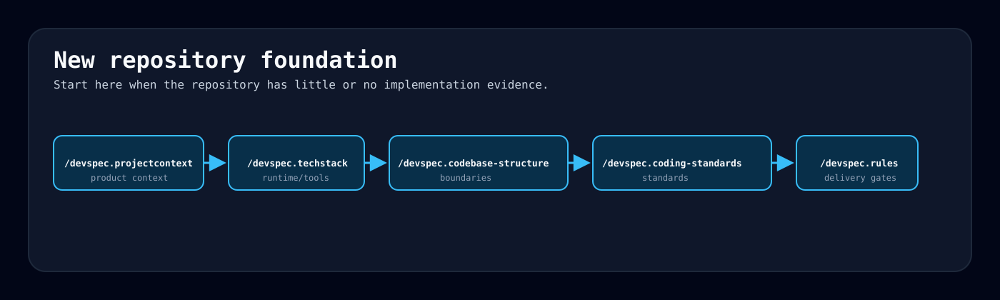
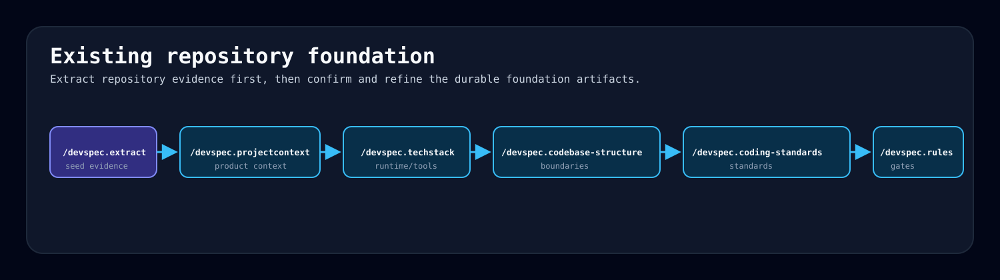
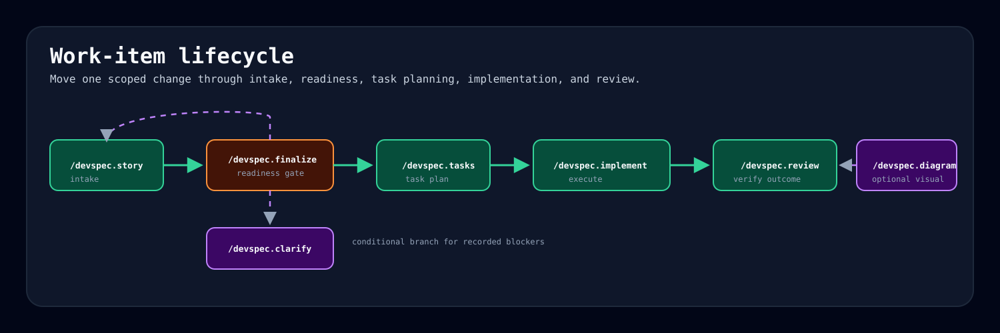
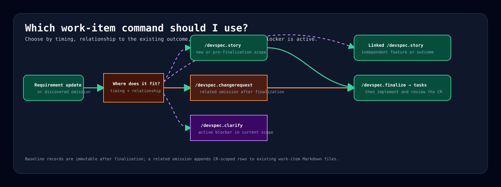

# devspec

`devspec` is a spec-driven development framework for teams using GitHub Copilot and other AI coding agents.

It stores planning, implementation, review, and recovery state in Git-tracked files instead of relying on chat history. Use it when you want agents to follow the same workflow for project context, engineering standards, work-item intake, implementation, review, and session recovery.

## Quick Start

Install with the `devspec` CLI from the target repository. The recommended one-off path is `uvx`, which avoids a permanent global install and works well on restricted developer machines.

```text
uvx devspec init --target . --profile all --repo-state existing
uvx devspec doctor --target . --profile all
```

Use `--repo-state new` for a new repository. After validation, commit the copied framework files, run the foundation flow, then start the first work item.

For the full setup manual, see [docs/how-to/README.md](docs/how-to/README.md).

## Setup Options

| Situation | Start here |
| --- | --- |
| Simplest one-off setup | [uv and uvx setup](docs/how-to/setup/uv.md) |
| Approved Windows package install | [WinGet setup](docs/how-to/setup/winget.md) |
| Persistent macOS/Linux package install | [Homebrew setup](docs/how-to/setup/homebrew.md) |
| CLI setup paths are blocked | [Manual copy setup](docs/how-to/setup/manual-copy.md) |

Install profiles let you choose which AI coding agent files to copy. Most multi-agent teams can start with `--profile all`; single-tool teams can use a smaller profile such as `copilot`, `codex`, `cursor`, `claude`, `gemini`, or `antigravity`.

## Core Workflow

`devspec` has two workflow layers.

| Layer | Purpose | Full guide |
| --- | --- | --- |
| Foundation | Capture stable project context, architecture, stack, structure, standards, and rules. | [New repository](docs/how-to/README.md#foundation-flow-for-a-new-repository), [existing repository](docs/how-to/README.md#foundation-flow-for-an-existing-repository) |
| Work items | Move one feature, bug, security issue, or accepted change request from intake to review. | [Work-item lifecycle](docs/how-to/README.md#work-item-lifecycle) |

For a new project:



```text
/devspec.projectcontext
/devspec.techstack
/devspec.codebase-structure
/devspec.coding-standards
/devspec.rules
```

For an existing project:



```text
/devspec.extract
/devspec.projectcontext
/devspec.techstack
/devspec.codebase-structure
/devspec.coding-standards
/devspec.rules
```

Then run the work-item flow:



```text
/devspec.story
/devspec.finalize
/devspec.tasks
/devspec.implement
/devspec.review
```

For a missed related requirement after finalization, use the append-only change-request route:



`/devspec.changerequest` -> `/devspec.finalize` -> `/devspec.tasks` -> `/devspec.implement` -> `/devspec.review`

Use `/devspec.clarify` only when a work item records a blocking question. Use `/devspec.changerequest` for a missed related requirement after finalization; it appends to existing work-item Markdown artifacts rather than creating a separate CR file. Use `/devspec.diagram` when a diagram would clarify architecture, workflow, state, sequence, or domain behavior.

## AI Tool Support

GitHub Copilot prompt and agent files are the reference implementation. Other adapters are thin wrappers around the same command registry and Git-tracked artifacts.

| Tool | Setup notes |
| --- | --- |
| GitHub Copilot | Native `/devspec.*` prompt commands through `.github/prompts/` and `.github/agents/`. |
| Claude Code | Project skills expose `/devspec-*` command-style invocations. |
| OpenAI Codex | `AGENTS.md` provides always-on repository instructions and Codex workflow guidance. |
| Cursor | Project rules guide Cursor Agent and Inline Edit. |
| Gemini CLI | `GEMINI.md` provides context; optional commands expose `/devspec:*` shortcuts. |
| Google Antigravity | Workspace rules and skills expose `/devspec-*` command-style invocations. |

Canonical command names remain `/devspec.*`. Some adapters expose host-native shortcuts such as `/devspec:story` or `/devspec-story`; see [Command Invocation by Agent](docs/how-to/README.md#command-invocation-by-agent).

## More Documentation

| Need | Start here |
| --- | --- |
| Install or troubleshoot setup | [docs/how-to/setup/README.md](docs/how-to/setup/README.md) |
| Run devspec workflows | [docs/how-to/README.md](docs/how-to/README.md) |
| Use command examples | [docs/how-to/README.md#command-examples](docs/how-to/README.md#command-examples) |
| Set up AI coding agents | [docs/how-to/README.md#ai-coding-agent-setup](docs/how-to/README.md#ai-coding-agent-setup) |
| Work across multiple repositories | [docs/how-to/README.md#multi-repo-work](docs/how-to/README.md#multi-repo-work) |
| Upgrade devspec files | [docs/how-to/README.md#upgrades](docs/how-to/README.md#upgrades) |
| Validate adapter behavior | [devspec/adapters/validation-flows.md](devspec/adapters/validation-flows.md) |
| Review adapter support details | [devspec/adapters/README.md](devspec/adapters/README.md) |
| Check platform compatibility | [devspec/adapters/compatibility-matrix.md](devspec/adapters/compatibility-matrix.md) |
| Plan enterprise rollout | [devspec/adapters/enterprise-governance.md](devspec/adapters/enterprise-governance.md) |

## License

This repository is released under the [Apache License 2.0](LICENSE).
