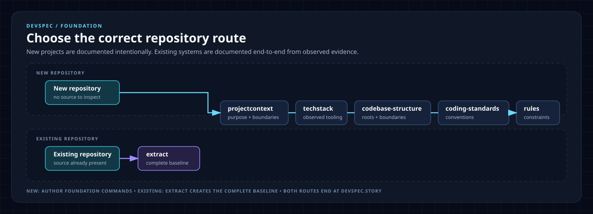
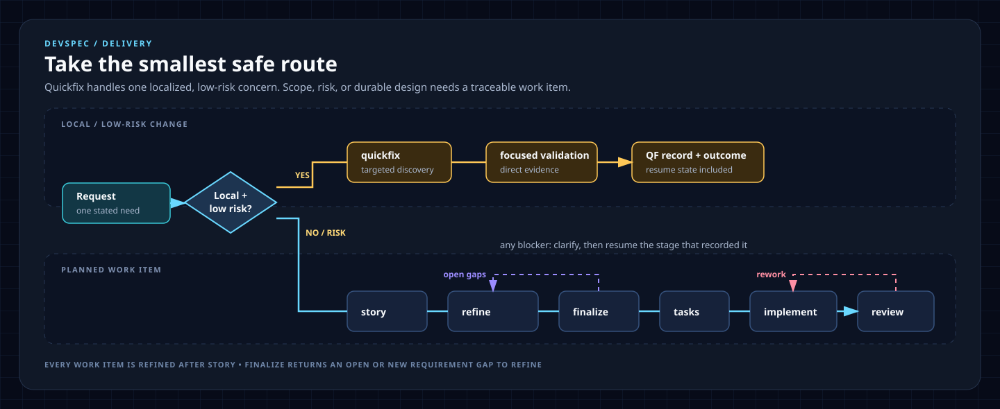

# devspec

devspec is a compact, resumable spec-driven workflow for AI coding agents. Git-tracked `devspec/` artifacts are the canonical project state, so planning, implementation, review, and recovery never depend on chat history.

## Choose a setup route

| Your situation | Use this guide |
|---|---|
| No installer, Python, package manager, or CLI | [Manual copy from `main`](docs/manual-copy.md) |
| Python is available; one-off or persistent CLI use | [Python and uvx](docs/setup-python.md) |
| Windows package-manager installation | [WinGet](docs/setup-winget.md) |
| macOS/Linux package-manager installation | [Homebrew](docs/setup-homebrew.md) |
| Already installed the CLI; need init, upgrade, or profile changes | [CLI lifecycle](docs/setup-lifecycle.md) |
| A repository already uses devspec 0.2.x | [Upgrade from devspec 0.2.x](docs/setup-lifecycle.md#upgrade-from-devspec-02x) |

Manual copying and CLI installation produce the same canonical `devspec/` content and agent wrappers, once the manual route resets the project records listed in its guide. In either route, set the target repository's `repository-state.md` to `new` or `existing`. Choose one setup route; the CLI is optional.

## CLI quick start

```powershell
uvx devspec init --target . --profile all --repo-state existing
uvx devspec doctor --target . --profile all
```

Use `--repo-state new` for a repository with no source yet. The [CLI quick start](docs/quickstart.md) covers both routes and the first command to run.

`init` copies the canonical contracts, protocols, and templates plus the wrappers for the selected agent profile, generates `devspec/foundation/repository-state.md` from `--repo-state`, and seeds empty `devspec/architecture/overview.md` and `artifact-queue.md`. Those three files and `devspec/constitution.md` are project-owned: `init` and `sync` never overwrite them, even with `--force`.

Before a framework upgrade, inspect drift with `devspec diff --target .` and preview it with `devspec sync --target . --profile all --dry-run`.

## Supported agent hosts

| Agent host | Profile | Installed wrapper | Invoke a command |
|---|---|---|---|
| GitHub Copilot | `copilot` | `.github/prompts/` and `.github/agents/` | `/devspec.story` |
| OpenAI Codex | `codex` | `AGENTS.md` | Ask for `devspec.story` |
| Claude Code | `claude` | `.claude/skills/` | `/devspec-story` |
| Cursor | `cursor` | `.cursor/rules/devspec-workflow.mdc` | Ask for `devspec.story` |
| Gemini CLI | `gemini` | `.gemini/commands/devspec/` | `/devspec:story` |
| Google Antigravity | `antigravity` | `.agents/skills/` | The `devspec-story` skill |

Each wrapper only points at its contract in `devspec/contracts/`, so every host runs the same workflow. The `all` profile installs every wrapper.

## Choose a workflow route





Use the [developer workflow guide](docs/workflows.md) for concrete quickfix, refinement, clarification, and change-request examples.

## How to

Follow the scenario-based [how-to guide](docs/how-to.md) to choose the right command, establish a baseline, deliver a story, work across repositories, or route a small fix safely. The [beginner command examples](docs/command-examples.md) give a first prompt for every command.

Two rules apply throughout. Confirm single-repository or multi-repository scope before every `devspec.*` command, unless current canonical evidence already records it. After starting a story, run the work-item commands or `continue` without repeating its ID: private per-worktree context resumes only the recorded next action.

## Contributing and releases

Run the test suite with `uv run python -m unittest discover -s tests`. Release pipelines, one-time publishing setup, and the release checklist are in [packaging/README.md](packaging/README.md).

## License

devspec is released under the [Apache License 2.0](LICENSE).
