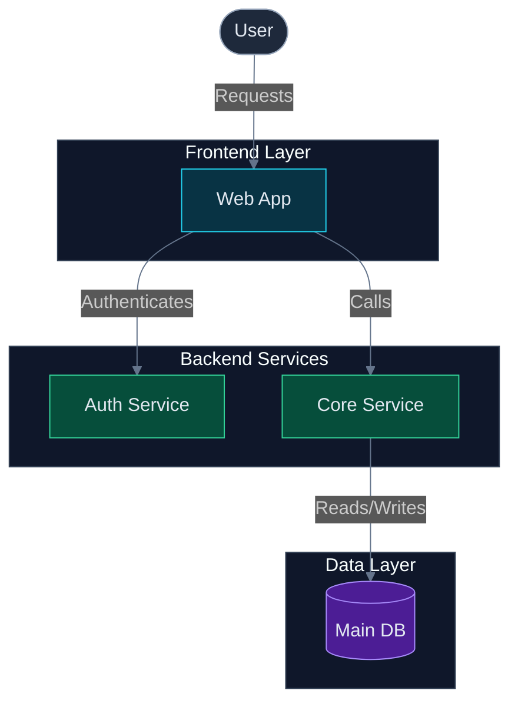

# Architecture Diagram

Use this artifact for one durable architecture, module, feature, workflow, process-flow, user journey, sequence, state, or domain diagram. Keep diagram status in `devspec/architecture/artifact-queue.md`; keep only generated content, supporting evidence, assumptions, and maintenance notes here.

## Resume State

| Field | Value |
| --- | --- |
| Current stage | diagram |
| Current command | `/devspec.diagram` |
| Current agent | devspec.diagram |
| Run status | See `devspec/glossary.md#run-status-values` |
| Current item | |
| Last completed step | |
| Next required action | |
| Pending user question | |
| Recommended option | |
| Resume command | `/devspec.diagram` |
| Resume notes | |
| Updated | |

## Diagram Metadata

| Field | Value |
| --- | --- |
| ID | |
| Display title | `DIA-NNN - <Title Case Diagram Name>` |
| Scope | architecture, module, feature, workflow, user-journey |
| Diagram type | flowchart, sequenceDiagram, journey, stateDiagram, classDiagram, erDiagram |
| Mermaid declaration | flowchart TD, flowchart LR, flowchart BT, sequenceDiagram, journey, stateDiagram-v2, classDiagram, erDiagram |
| Subject | `dia-NNN-<diagram-name>` |
| Confidence | observed, high-confidence, low-confidence |
| Tags | |
| Queue row | `devspec/architecture/artifact-queue.md#diagram-queue-register` |

## Mermaid Diagram

- Keep durable `DIA-*` IDs and `dia-NNN-*` subjects in metadata and filenames only; Mermaid content uses simple internal naming.
- Use short alphanumeric node IDs, double-quoted node labels of 1-4 words, and 2-3 word edge labels. Do not use `\n` or ` ` inside node labels or edge labels.
- Keep architectural flowcharts focused on one primary domain at macro level, structurally unidirectional, and adjacent by layer. Do not include overloaded graphs, cross-layer arrows, decision diamonds, UI micro-interactions, or return/error paths unless the diagram is explicitly an algorithm or activity flowchart.
- Use `sequenceDiagram` for exact step-by-step request and response behavior. Sequence diagrams should show happy-path messages between distinct participants, collapse pass-through API client helpers, and use method names for message labels.
- Keep runtime communication and compile-time project dependencies in separate diagrams. Logical architecture diagrams exclude SDLC actors and build artifacts, and keep owned application databases inside the system boundary.
- Avoid API, Swagger, tech stack, version, library, hosting, and framework boilerplate details in flowchart nodes unless the diagram is specifically about startup, request-pipeline, infrastructure-layer, or physical deployment behavior.
- Apply the Mermaid Visual Quality Pattern: (1) open flowcharts with the dark theme init block, (2) declare `classDef` entries for every role present, (3) use role-appropriate node shapes, (4) wrap boundaries of 3+ nodes in named `subgraph` blocks, (5) draw cross-subgraph arrows after all `end` keywords, (6) assign `classDef` classes in a batch block at the end, (7) keep node count ≤ 15.

## Source Evidence and Assumptions

Use `evidence` for directly supported code, docs, config, ADRs, or user-confirmed facts. Use `assumption` only when the diagram depends on an inference that is not fully confirmed.

| Type | Source or assumption | Diagram impact | Resolution |
| --- | --- | --- | --- |
| evidence |  |  | confirmed |
| assumption |  |  | open |

## Maintenance Notes

| Note | Action or owner | Resolution state |
| --- | --- | --- |
|  |  | open |
