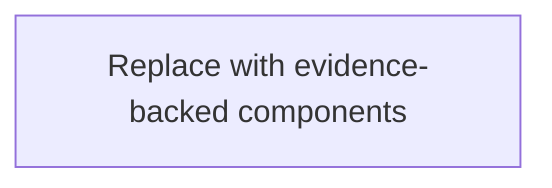

# Architecture Overview

## System View

- Major components:

## External Integrations

- Integration 1:

## Data Flow

- Flow 1:

## Architecture Diagrams

Use Mermaid diagrams only when repository evidence supports the relationships. Label inferred relationships in the diagram title or notes, or leave a blocker instead of drawing unsupported links.

### System Context

## Key Decisions

- Decision reference:

## Blockers

- Blocker 1:
