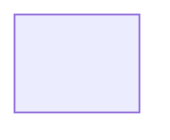

# Work-Item Diagrams

Use this file only for explicit or clearly temporary work-item diagrams.

Reusable diagrams live under `devspec/architecture/diagrams/`; durable SVGs live under `devspec/architecture/images/`. `devspec/architecture/artifact-queue.md` owns diagram status. Temporary SVGs for this work item belong under `devspec/work-items/<work-item-folder>/images/`.

## Resume State

| Field | Value |
| --- | --- |
| Current stage | diagram |
| Current command | `/devspec.diagram` |
| Current agent | devspec.diagram |
| Run status | See `devspec/glossary.md#run-status-values` |
| Current item | |
| Last completed step | |
| Next required action | |
| Pending user question | |
| Recommended option | |
| Resume command | `/devspec.diagram` |
| Resume notes | |
| Updated | |

## Diagram Content

### DIA-001 - <subject>

| Field | Value |
| --- | --- |
| Type | |
| Output format | mermaid, svg, mermaid+svg |
| Subject | |
| SVG target | `devspec/work-items/<work-item-folder>/images/<diagram-name>.svg` when output format includes svg |
| Queue source | `devspec/architecture/artifact-queue.md` |
| Evidence sources | |
| Confidence | observed, high-confidence, low-confidence |
| Assumptions | none or listed below |
| Notes | |

Follow `.github/prompts/PATTERNS.md#diagram-extraction-consistency-pattern`, `#mermaid-internal-naming-and-readability-pattern`, `#mermaid-visual-quality-pattern`, and `#svg-output-pattern` when generating content.

For `format=svg`, omit the Mermaid block content and reference the generated SVG target above. For `format=mermaid+svg`, keep both the Mermaid block and SVG target reference.
