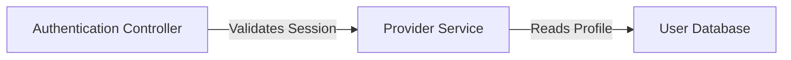

# devspec How-To

Use this manual after copying `devspec` into a target repository. It gives developers copy-ready examples for installing the framework, running the foundation flow, moving a work item through the lifecycle, using multiple AI coding agents, handling multi-repo systems, resolving provider work items, validating adapters, and upgrading framework files.

This guide is practical usage documentation. The provider-neutral source of truth for command purpose, required input, outputs, mutation level, and handoff remains `devspec/adapters/command-registry.md`.

## Contents

- [Install devspec](#install-devspec)
- [AI Coding Agent Setup](#ai-coding-agent-setup)
- [Command Invocation by Agent](#command-invocation-by-agent)
- [Foundation Flow for a New Repository](#foundation-flow-for-a-new-repository)
- [Foundation Flow for an Existing Repository](#foundation-flow-for-an-existing-repository)
- [Work-Item Lifecycle](#work-item-lifecycle)
- [Command Examples](#command-examples)
- [Diagrams](#diagrams)
- [Multi-Repo Work](#multi-repo-work)
- [Provider Integrations](#provider-integrations)
- [Validation](#validation)
- [Upgrades](#upgrades)
- [Troubleshooting](#troubleshooting)

## Install devspec

Copy the framework files into the target repository. There is no package manager or CLI installer yet.

1. Open the target repository in VS Code or the selected AI coding tool.
2. Copy the core framework folders into the repository root:

   ```text
   devspec/
   .github/prompts/
   .github/agents/
   ```

3. Copy AI coding agent support files for the tools your team uses.
4. Commit the copied files.
5. Run the foundation flow.
6. Start the first work item.

## AI Coding Agent Setup

| AI coding agent | Copy into target repository | Notes |
| --- | --- | --- |
| GitHub Copilot | `.github/prompts/`, `.github/agents/`; optional `.github/skills/` | Reference implementation with native `/devspec.*` prompt commands in VS Code. |
| Claude Code | `.claude/` | Project skills expose `/devspec-*` command-style invocations. |
| OpenAI Codex | `AGENTS.md` | Codex reads always-on repository instructions and treats `/devspec.*` as workflow intent. |
| Cursor | `AGENTS.md`, `.cursor/` | Cursor rules guide Agent and Inline Edit; exact slash-command registration is not assumed. |
| Gemini CLI | `GEMINI.md`; optional `.gemini/` | `GEMINI.md` provides context; `.gemini/commands/devspec/*.toml` adds native `/devspec:*` shortcuts. |
| Google Antigravity | `AGENTS.md`, `.agents/` | Workspace rules and skills expose `/devspec-*` command-style invocations. |

Copy only the rows for tools your team uses. Keep credentials, provider tokens, personal settings, and local auth outside prompt, agent, adapter, and artifact files.

## Command Invocation by Agent

Canonical command names remain `/devspec.*`. Some AI coding agents expose host-native command styles that translate to the same canonical command intent.

| Canonical command | GitHub Copilot | Claude Code | OpenAI Codex | Cursor | Gemini CLI | Google Antigravity |
| --- | --- | --- | --- | --- | --- | --- |
| `/devspec.extract` | `/devspec.extract` | `/devspec-extract` | `Run /devspec.extract ...` | `Run /devspec.extract ...` | `/devspec:extract` | `/devspec-extract` |
| `/devspec.projectcontext` | `/devspec.projectcontext` | `/devspec-projectcontext` | `Run /devspec.projectcontext ...` | `Run /devspec.projectcontext ...` | `/devspec:projectcontext` | `/devspec-projectcontext` |
| `/devspec.techstack` | `/devspec.techstack` | `/devspec-techstack` | `Run /devspec.techstack ...` | `Run /devspec.techstack ...` | `/devspec:techstack` | `/devspec-techstack` |
| `/devspec.codebase-structure` | `/devspec.codebase-structure` | `/devspec-codebase-structure` | `Run /devspec.codebase-structure ...` | `Run /devspec.codebase-structure ...` | `/devspec:codebase-structure` | `/devspec-codebase-structure` |
| `/devspec.coding-standards` | `/devspec.coding-standards` | `/devspec-coding-standards` | `Run /devspec.coding-standards ...` | `Run /devspec.coding-standards ...` | `/devspec:coding-standards` | `/devspec-coding-standards` |
| `/devspec.rules` | `/devspec.rules` | `/devspec-rules` | `Run /devspec.rules ...` | `Run /devspec.rules ...` | `/devspec:rules` | `/devspec-rules` |
| `/devspec.story` | `/devspec.story` | `/devspec-story` | `Run /devspec.story ...` | `Run /devspec.story ...` | `/devspec:story` | `/devspec-story` |
| `/devspec.clarify` | `/devspec.clarify` | `/devspec-clarify` | `Run /devspec.clarify ...` | `Run /devspec.clarify ...` | `/devspec:clarify` | `/devspec-clarify` |
| `/devspec.finalize` | `/devspec.finalize` | `/devspec-finalize` | `Run /devspec.finalize ...` | `Run /devspec.finalize ...` | `/devspec:finalize` | `/devspec-finalize` |
| `/devspec.tasks` | `/devspec.tasks` | `/devspec-tasks` | `Run /devspec.tasks ...` | `Run /devspec.tasks ...` | `/devspec:tasks` | `/devspec-tasks` |
| `/devspec.implement` | `/devspec.implement` | `/devspec-implement` | `Run /devspec.implement ...` | `Run /devspec.implement ...` | `/devspec:implement` | `/devspec-implement` |
| `/devspec.review` | `/devspec.review` | `/devspec-review` | `Run /devspec.review ...` | `Run /devspec.review ...` | `/devspec:review` | `/devspec-review` |
| `/devspec.diagram` | `/devspec.diagram` | `/devspec-diagram` | `Run /devspec.diagram ...` | `Run /devspec.diagram ...` | `/devspec:diagram` | `/devspec-diagram` |

For OpenAI Codex and Cursor, exact slash-command registration is not assumed. If the tool does not invoke the command directly, type the example as a chat instruction and let the AI coding agent read `AGENTS.md`, `devspec/adapters/command-registry.md`, and the canonical prompt and agent files named in the registry.

## Foundation Flow for a New Repository

Use this flow when the repository is new or has little implementation evidence.

| Step | Command | Produces |
| --- | --- | --- |
| 1 | `/devspec.projectcontext` | `devspec/foundation/project-context.md` |
| 2 | `/devspec.techstack` | `devspec/foundation/tech-stack.md` |
| 3 | `/devspec.codebase-structure` | `devspec/foundation/codebase-structure.md` |
| 4 | `/devspec.coding-standards` | `devspec/foundation/coding-standards.md` |
| 5 | `/devspec.rules` | `devspec/foundation/rules.md` |

GitHub Copilot:

```text
/devspec.projectcontext
/devspec.techstack
/devspec.codebase-structure
/devspec.coding-standards
/devspec.rules
```

Claude Code or Google Antigravity:

```text
/devspec-projectcontext
/devspec-techstack
/devspec-codebase-structure
/devspec-coding-standards
/devspec-rules
```

OpenAI Codex or Cursor:

```text
Run /devspec.projectcontext for this new repository.
Run /devspec.techstack.
Run /devspec.codebase-structure.
Run /devspec.coding-standards.
Run /devspec.rules.
```

Gemini CLI:

```text
/devspec:projectcontext
/devspec:techstack
/devspec:codebase-structure
/devspec:coding-standards
/devspec:rules
```

## Foundation Flow for an Existing Repository

Use this flow when existing code, docs, manifests, configuration, or tests should seed the foundation.

| Step | Command | Produces |
| --- | --- | --- |
| 1 | `/devspec.extract` | Extraction state, foundation seed content, architecture overview, diagram queue candidates |
| 2 | `/devspec.projectcontext` | Confirmed or refined product context |
| 3 | `/devspec.techstack` | Confirmed or refined stack inventory |
| 4 | `/devspec.codebase-structure` | Confirmed repository layout, access, boundaries, and contracts |
| 5 | `/devspec.coding-standards` | Confirmed engineering standards and anti-patterns |
| 6 | `/devspec.rules` | Confirmed operational rules, compliance requirements, and delivery gates |

GitHub Copilot:

```text
/devspec.extract
/devspec.projectcontext
/devspec.techstack
/devspec.codebase-structure
/devspec.coding-standards
/devspec.rules
```

Claude Code or Google Antigravity:

```text
/devspec-extract
/devspec-projectcontext
/devspec-techstack
/devspec-codebase-structure
/devspec-coding-standards
/devspec-rules
```

OpenAI Codex or Cursor:

```text
Run /devspec.extract for the current project root.
Run /devspec.projectcontext.
Run /devspec.techstack.
Run /devspec.codebase-structure.
Run /devspec.coding-standards.
Run /devspec.rules.
```

Gemini CLI:

```text
/devspec:extract
/devspec:projectcontext
/devspec:techstack
/devspec:codebase-structure
/devspec:coding-standards
/devspec:rules
```

Extraction can also target another local path, repository URL, or named multi-repo sources:

```text
/devspec.extract D:\path\to\repo
/devspec.extract https://github.com/example/repo
/devspec.extract UI - D:\repo-ui, API - D:\repo-api
```

For OpenAI Codex or Cursor, use the same input as chat intent:

```text
Run /devspec.extract with source D:\path\to\repo.
Run /devspec.extract with source https://github.com/example/repo.
Run /devspec.extract with sources UI - D:\repo-ui, API - D:\repo-api.
```

## Work-Item Lifecycle

Use the work-item lifecycle after the foundation exists.

| Step | Command | Gate or note |
| --- | --- | --- |
| 1 | `/devspec.story` | Accepts a provider URL, provider identifier, manual feature request, bug report, security issue, task, or PBI. |
| 2 | `/devspec.clarify` | Use only when intake or finalization records a blocking question. |
| 3 | `/devspec.finalize` | Creates the implementation readiness brief. |
| 4 | `/devspec.tasks` | Requires `finalize.md` marked `ready`. |
| 5 | `/devspec.implement` | Requires ready `finalize.md` and `tasks.md`; may edit code when repository access allows it. |
| 6 | `/devspec.review` | Reviews implemented work against the finalized brief and records the review outcome. |

GitHub Copilot:

```text
/devspec.story GitHub issue https://github.com/example/repo/issues/123
/devspec.finalize
/devspec.tasks
/devspec.implement
/devspec.review
```

Claude Code or Google Antigravity:

```text
/devspec-story GitHub issue https://github.com/example/repo/issues/123
/devspec-finalize
/devspec-tasks
/devspec-implement
/devspec-review
```

OpenAI Codex or Cursor:

```text
Run /devspec.story for GitHub issue https://github.com/example/repo/issues/123.
Run /devspec.finalize.
Run /devspec.tasks.
Run /devspec.implement.
Run /devspec.review.
```

Gemini CLI:

```text
/devspec:story GitHub issue https://github.com/example/repo/issues/123
/devspec:finalize
/devspec:tasks
/devspec:implement
/devspec:review
```

If a blocking question is recorded, resolve it before continuing:

```text
/devspec.clarify
```

## Command Examples

Use these examples as starting points. The command registry remains authoritative for required input, output artifacts, mutation level, and next handoff.

| Canonical command | Common input examples | Main output | Next handoff |
| --- | --- | --- | --- |
| `/devspec.extract` | Blank for current root; `D:\path\to\repo`; `UI - D:\repo-ui, API - D:\repo-api` | Extraction state, foundation artifacts, architecture overview, artifact queue | `/devspec.projectcontext` |
| `/devspec.projectcontext` | Product brief, audience notes, business goals, scope boundaries | `devspec/foundation/project-context.md` | `/devspec.techstack` |
| `/devspec.techstack` | Runtime, framework, hosting, tooling, CI, support constraints | `devspec/foundation/tech-stack.md` | `/devspec.codebase-structure` |
| `/devspec.codebase-structure` | Repository layout, work areas, integration boundaries, access requirements | `devspec/foundation/codebase-structure.md` | `/devspec.coding-standards` |
| `/devspec.coding-standards` | Style guides, observed patterns, testing expectations, anti-patterns | `devspec/foundation/coding-standards.md` | `/devspec.rules` |
| `/devspec.rules` | Compliance requirements, delivery gates, forbidden patterns, governance rules | `devspec/foundation/rules.md` | `/devspec.story` |
| `/devspec.story` | `https://github.com/example/repo/issues/123`; `owner/repo#123`; `JIRA-123`; manual bug report | Work-item `meta.md`, `story.md`, `decisions.md`, `notes.md` | `/devspec.clarify` if blocked, otherwise `/devspec.finalize` |
| `/devspec.clarify` | Existing work item with a recorded blocker | Work-item `clarify.md` | Repeat until unblocked, then `/devspec.finalize` |
| `/devspec.finalize` | Existing story artifacts plus optional readiness input | Work-item `finalize.md` | `/devspec.tasks` when ready |
| `/devspec.tasks` | Ready `finalize.md`; optional task-planning guidance | Work-item `tasks.md` | `/devspec.implement` |
| `/devspec.implement` | Ready `finalize.md` and `tasks.md`; optional validation guidance | Work-item `implement.md` and code changes when allowed | `/devspec.review` |
| `/devspec.review` | `finalize.md` and `implement.md`; optional review focus | Work-item `review.md` | Return to `/devspec.implement` for changes or close the work item |
| `/devspec.diagram` | Diagram subject, work item, or explicit process-flow batch request | Architecture or work-item Mermaid diagram artifacts | Continue the current workflow |

## Diagrams

Use `/devspec.diagram` when a Mermaid diagram would clarify architecture, workflow, state, sequence, domain behavior, user journey, or a work-item-specific flow.

Examples:

```text
/devspec.diagram checkout payment flow
/devspec.diagram authentication state transitions
/devspec.diagram batch-generate queued process-flow diagrams
```

Durable detailed diagrams live under `devspec/architecture/diagrams/`. High-level architecture diagram references belong in `devspec/architecture/overview.md`. Temporary work-item-specific diagrams belong in `devspec/work-items/<work-item-folder>/diagrams.md`.

Extraction may seed diagram candidates into `devspec/architecture/artifact-queue.md`. Use `/devspec.diagram` as the normal follow-up for generation.

Generated diagrams should use simple Mermaid internal naming: short alphanumeric node IDs, double-quoted node labels of 1-4 words, and short edge labels for interaction context. Keep `DIA-*` and `dia-NNN-*` names for the durable diagram file and diagram queue, not for Mermaid nodes.

Example Mermaid style:



## Multi-Repo Work

For multi-repo systems, open one workspace or AI coding agent project that includes every repository the agent should inspect, edit, test, or coordinate.

Use named source input during extraction:

```text
/devspec.extract UI - D:\repo-ui, API - D:\repo-api, Jobs - D:\repo-jobs
```

For OpenAI Codex or Cursor:

```text
Run /devspec.extract with sources UI - D:\repo-ui, API - D:\repo-api, Jobs - D:\repo-jobs.
```

Record repository roles, local paths, workspace membership, access requirements, boundaries, and integration contracts in:

```text
devspec/foundation/codebase-structure.md
```

Do not infer access from repository location. If access is missing or ambiguous, the agent should ask for confirmation and record blockers rather than guessing.

## Provider Integrations

Use provider integrations when `/devspec.story` should resolve GitHub, Jira, Azure DevOps, or another external work-item reference.

Preferred inputs:

| Provider | Preferred input | Accepted shorthand | Guardrail |
| --- | --- | --- | --- |
| GitHub | Full issue or pull request URL | `owner/repo#123` | Reject bare numbers unless repository context is configured. |
| Jira | Full issue URL | `ABC-123` | Reject malformed keys or keys outside configured project patterns. |
| Azure DevOps | Full work item URL | Numeric ID only with configured organization and project context | Reject numeric IDs when organization or project context is missing. |

Examples:

```text
/devspec.story https://github.com/example/repo/issues/123
/devspec.story owner/repo#123
/devspec.story JIRA-123
/devspec.story https://dev.azure.com/org/project/_workitems/edit/123
```

Provider resolution must show a confirmation summary before creating or updating the work-item folder. If the provider integration is unavailable, manual intake is allowed only when the user explicitly chooses that fallback and supplies the required manual fields.

Provider policy lives in:

```text
devspec/foundation/provider-integrations.md
```

Keep provider authentication and credentials outside prompt artifacts.

## Validation

Before using an adapter for enterprise delivery, validate these flows with the target AI coding agent:

- New repository foundation flow.
- Existing repository extraction flow.
- End-to-end story lifecycle.
- Cross-tool recovery from Git-tracked artifacts.

Use:

```text
devspec/adapters/validation-flows.md
```

For cross-tool recovery, start a command in one AI coding agent, stop after a recorded checkpoint or blocker, then continue from the same repository in another AI coding agent. The second agent should recover from Git-tracked `devspec/` artifacts instead of chat history.

## Upgrades

Framework-owned files may be replaced or diff-applied during upgrades:

```text
.github/prompts/
.github/agents/
.github/skills/
.claude/
.cursor/
.gemini/
.agents/
AGENTS.md
GEMINI.md
devspec/adapters/
devspec/**/_template/
docs/how-to/
```

Project-owned files should be migrated or merged, not overwritten:

```text
devspec/foundation/*.md
devspec/architecture/*.md
devspec/architecture/diagrams/*.md
devspec/work-items/**
devspec/constitution.md
devspec/glossary.md
```

During an upgrade:

1. Diff framework-owned files against the new version.
2. Preserve local adapter limitations and enterprise policy notes when they are still true.
3. Merge project-owned artifacts manually.
4. Re-run the validation flows for every AI coding agent the team uses.

## Troubleshooting

| Problem | What to do |
| --- | --- |
| The AI coding agent does not recognize `/devspec.extract`. | Use the command as chat intent, such as `Run /devspec.extract for the current project root.` |
| A command tries to continue from chat history. | Tell it to recover from Git-tracked `devspec/` artifacts first. |
| A work item cannot move to `/devspec.tasks`. | Check whether `finalize.md` is marked `ready`; resolve blockers first. |
| `/devspec.implement` wants to edit the wrong repository. | Check `devspec/foundation/codebase-structure.md` repository configuration and access requirements. |
| Provider lookup fails. | Classify the failure as not found, access denied, malformed input, or integration unavailable; use manual intake only after explicit user choice. |
| Diagram generation creates duplicate subjects. | Check `devspec/architecture/artifact-queue.md` and existing files under `devspec/architecture/diagrams/` before creating a new diagram. |
