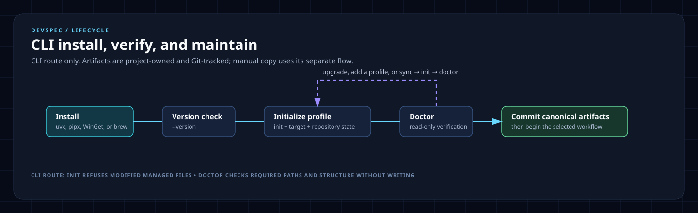

# CLI lifecycle

Use this guide only after installing the devspec CLI through `uvx`, `uv tool`, `pipx`, WinGet, or Homebrew. It covers CLI initialization, validation, upgrades, canonical-artifact synchronization, and profile changes. Manual copying has its own [manual-copy lifecycle](manual-copy.md) and does not require this CLI flow.

## Lifecycle at a glance



The terminal CLI is `devspec`. After initialization, the installed agent wrappers expose the `devspec.*` workflow commands. They are intentionally different interfaces.

## Command map

| Goal | Use | Notes |
|---|---|---|
| Install the CLI | `uvx`, `uv tool`, `pipx`, WinGet, or Homebrew | Choose one package-manager route below. |
| Check version | `devspec --version` | Confirms the installed CLI. `devspec version` prints the same output. |
| Initialize | `devspec init --target <path> --profile <profile> --repo-state <new\|existing>` | Copies canonical artifacts and selected wrappers. `--profile` defaults to `all`. |
| Validate | `devspec doctor --target <path> --profile <profile>` | Read-only check of contracts, protocols, templates, and wrappers. Exits 1 on errors. |
| Compare installed framework files | `devspec diff --target <path>` | Read-only drift report. Exits 1 when files are missing, modified, stale, obsolete, or recorded under another profile. |
| Synchronize canonical artifacts | `devspec sync --target <path> --profile <profile> --dry-run` | Preview, then run without `--dry-run`; use `--force` only for reviewed framework-owned edits. |
| Run delivery work | Agent command such as `devspec.story` or `devspec.quickfix` | Use after initialization; see the [workflow guide](workflows.md). |

`sync` requires `--profile`. `doctor` and `diff` use the profile recorded in `devspec/.install-manifest.json` when you omit it, or `all` when there is no manifest.

`devspec upgrade` is not a CLI command; upgrade the package with its package manager, then use `diff` and `sync` to update the installed framework files.

## 1. Install devspec

Choose one supported CLI route:

| Platform or preference | Example |
|---|---|
| One-off, any OS | `uvx devspec --help` |
| Persistent Python install | `uv tool install devspec` or `pipx install devspec` |
| Windows package manager | `winget install --id SpecLabs.Devspec --exact` |
| Homebrew tap | `brew install speclabs/tap/devspec` |

For a no-installer setup, use [manual copy from `main`](manual-copy.md).

## 2. Initialize a repository

Use `existing` when source code already exists:

```powershell
devspec init --target D:\Code\orders --profile all --repo-state existing
devspec doctor --target D:\Code\orders --profile all
```

Use `new` before the first foundation workflow in a blank repository:

```powershell
devspec init --target D:\Code\orders --profile copilot --repo-state new
devspec doctor --target D:\Code\orders --profile copilot
```

`all` installs every supported wrapper. Use `copilot`, `codex`, `claude`, `cursor`, `gemini`, or `antigravity` when the repository uses only that agent host.

Commit the installed files, including `devspec/.install-manifest.json`. `sync` compares against that manifest to tell a stale packaged file from a local edit.

## 3. Validate the CLI installation

Run Doctor after CLI initialization, after an upgrade, and before reporting a CLI setup problem:

```powershell
devspec doctor --target D:\Code\orders --profile all
```

Doctor checks that each canonical contract, XML protocol, and selected adapter wrapper exists and that wrappers point to their matching contract. It does not modify repository code.

## 4. Upgrade the CLI

Upgrade using the same installation method:

```powershell
# uvx: use the latest package for the next command
uvx devspec@latest --help

# uv tool
uv tool upgrade devspec

# pipx
pipx upgrade devspec

# WinGet
winget upgrade --id SpecLabs.Devspec --exact

# Homebrew
brew update
brew upgrade devspec
```

After upgrading, synchronize and validate the target repository.

## 5. Compare and synchronize canonical framework files

Preview the exact upgrade first, then apply it:

```powershell
devspec diff --target D:\Code\orders
devspec sync --target D:\Code\orders --profile all --dry-run
devspec sync --target D:\Code\orders --profile all
devspec doctor --target D:\Code\orders --profile all
```

`sync` adds missing files and replaces packaged files that have not been locally edited. It never overwrites a locally modified framework-owned file unless `--force` is supplied, never overwrites project-owned artifacts, and never deletes retained obsolete wrappers. It also updates work-item `meta.md` stage and next values that a renamed command left behind; `doctor` reports any that remain. When `sync` reports a conflict it writes nothing at all, so review every listed file before using `--force`, which replaces all of them.

## 6. Change or add a profile

The install manifest records one profile: the one used by the latest `init` or `sync`. To add an agent host, re-run `init` with a profile that covers every host the repository uses, which is usually `all`:

```powershell
devspec init --target D:\Code\orders --profile all --repo-state existing
devspec doctor --target D:\Code\orders --profile all
```

Re-running `init` is safe: it skips unchanged files and never overwrites project-owned files. Do not add a host with its single profile. For example, `init --profile codex` in a Copilot repository adds `AGENTS.md` but records only `codex`, so `diff` then reports the Copilot wrappers as retained obsolete files and later `sync --profile codex` stops updating them.

Changing to a narrower profile does not delete wrappers from other agents. `diff` lists them as retained obsolete files. Remove them manually only after confirming no team member needs them.

## 7. Start using the workflow

For a new repository, start with `devspec.projectcontext`. For an existing repository, start with `devspec.extract`. Then follow the route in [the workflow guide](workflows.md). Use `devspec.quickfix` only for one localized, low-risk change.

## Upgrade from devspec 0.2.x

devspec 0.3.0 replaced the 0.2.x framework. Commands are now contracts in `devspec/contracts/` that load shared `devspec/protocols/`, every wrapper was regenerated, the CLI reports its version with `devspec --version` (the 0.2.x `devspec version` still works as an alias), and the `core` profile no longer exists. A 0.2.x installation upgrades in place:

1. Upgrade the CLI with its package manager, and confirm `devspec --version` reports 0.3.0 or later.
2. From a clean Git working tree in the target repository, preview the upgrade:

   ```powershell
   devspec diff --target .
   devspec sync --target . --profile all --dry-run
   ```

   Use the profile the repository needs. A `core` installation has no direct equivalent: use `all`, or `copilot` if the repository does not rely on `AGENTS.md`. Untouched 0.2.x framework files are reported as stale and will be replaced, and work-item `meta.md` values left by the `devspec.grooming` to `devspec.refine` rename will be rewritten.
3. Apply the upgrade and validate it:

   ```powershell
   devspec sync --target . --profile all
   devspec doctor --target . --profile all
   ```

4. Review the retained obsolete files that `sync` lists; it never deletes them. They are framework files that 0.3.0 no longer ships, such as `devspec/adapters/`, `GEMINI.md`, `.agents/rules/`, `.github/skills/exploration-recovery/`, `.github/prompts/README.md`, and `.github/prompts/PATTERNS.md`. Delete them once nothing references them. Project records that 0.2.x tracked, such as `devspec/foundation/*.md` outside `_template/` and your work items, stay in place and are not reported.
5. Commit the result, including `devspec/.install-manifest.json`.

If `sync` reports a conflict, that file differs from what 0.2.x installed. `devspec/glossary.md` was project-owned in 0.2.x and is framework-owned now, so a customized glossary conflicts: copy your terms aside, resolve every other listed conflict the same way, run `sync --force`, and merge your terms back.
